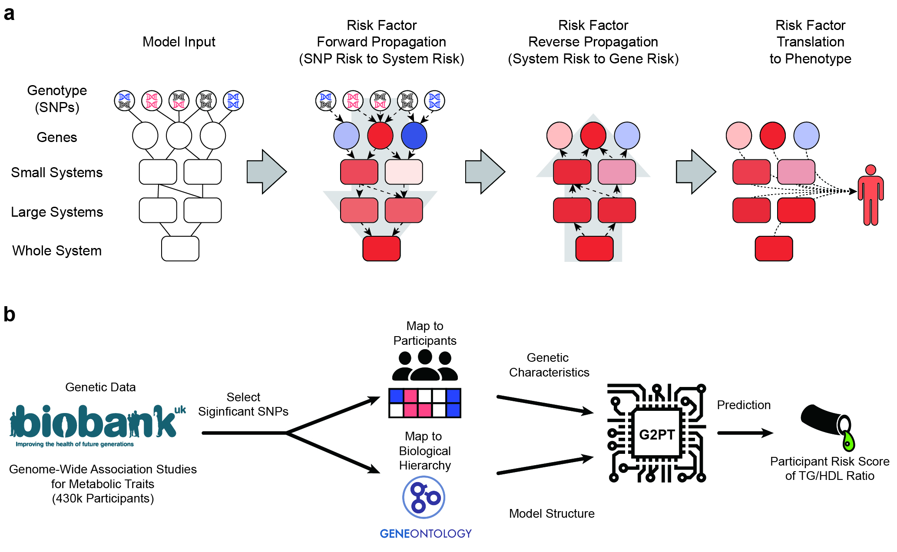

# G2PT: A genotype-phenotype transformer to assess and explain polygenic risk

## Overview

Genome-wide association studies have linked millions of genetic variants to human phenotypes, yet translating those findings into clinical insight is limited by interpretability and genetic interactions. G2PT is a hierarchical Genotype-to-Phenotype Transformer that models bidirectional information flow among polymorphisms, genes, molecular systems, and phenotypes. It has been applied to predict metabolic traits in the UK Biobank (e.g., diabetes risk and TG/HDL ratio) and to surface pathway-level explanations through attention weights.



## Key capabilities

- Hierarchical transformer with SNP → gene → system → phenotype message passing and optional system ↔ environment edges.
- **Sparse edge-based attention** for 100-1000× memory reduction, enabling batch sizes of 256+ with 32GB GPU (default enabled).
- Works with PLINK binary files or tab-delimited genotype matrices; supports multiple phenotypes (binary via `--bt`, quantitative via `--qt`).
- Distributed training via `torchrun`, with early stopping, masked-language-model pretraining (`--mlm`), and mixture-of-experts predictors (`--use_moe`).
- Predict-only and attention-export pipeline for downstream interpretation.
- Companion notebooks for ontology curation, visualization, Sankey plots, and epistasis exploration.

## Environment setup

The repository ships with a conda environment (Python 3.8, CUDA 12.1-compatible PyTorch nightly) that includes all required dependencies.

```bash
conda env create -f environment.yml
conda activate G2PT_github
# From the repository root so `src/` is importable
export PYTHONPATH=.
```

## Input preparation

1. **Genotypes**
   - PLINK binary files (`.bed/.bim/.fam`) passed via `--train-bfile` / `--val-bfile` / `--test-bfile`.
   - Tab-delimited genotype matrices (rows = IID, columns = variant IDs) passed via `--train-tsv` / `--val-tsv`; set `--input-format` to `indices` or `binary` as appropriate. Use `--flip` if alleles need to be swapped.

2. **Covariates and phenotypes**
   - Tab-separated text matching PLINK `.cov` / `.pheno` conventions. Provide columns for `FID` and `IID` plus any covariates/phenotypes.
   - Restrict covariates with `--cov-ids SEX AGE PC1 PC2 ...`. Declare phenotype types with `--bt` (binary) and `--qt` (quantitative). If a phenotype file is omitted, include a `PHENOTYPE` column in the covariate file.

   *Example covariates* ([samples/train.cov](samples/train.cov)):

   | FID      | IID      | SEX | AGE | PC1 | PC2 | ... | PC10 |
   |----------|----------|-----|-----|-----|-----|-----|------|
   | 10008090 | 10008090 | 1   | 48  | 3   | 0.3 | ... | 0.5  |

   *Example phenotypes* ([samples/train.pheno](samples/train.pheno)):

   | FID      | IID      | PHENOTYPE |
   |----------|----------|-----------|
   | 10008090 | 10008090 | 1.2       |

3. **Ontology / hierarchy** (`--onto`)
   - Tab-delimited file with three columns: parent term, child term (term or gene), and `interaction_type` (e.g., `default` for term→term edges or `gene` for term→gene annotations). For nested subtrees, supply custom interaction types and pass them through `--interaction-types`.

   *Example ontology* ([samples/ontology.txt](samples/ontology.txt)):

   | parent     | child      | interaction_type |
   |------------|------------|------------------|
   | GO:0045834 | GO:0045923 | default          |
   | GO:0045834 | GO:0043552 | default          |
   | GO:0045923 | AKT2       | gene             |
   | GO:0045923 | IL1B       | gene             |
   | GO:0043552 | PIK3R4     | gene             |

4. **SNP-to-gene mapping** (`--snp2gene`)
   - Tab-delimited mapping of SNP IDs to genes. Optional columns such as `chr`, `pos`, or `block_ind` are ingested when present. PLINK `.bim` information overrides overlapping fields.

   *Example mapping* ([samples/snp2gene.txt](samples/snp2gene.txt)):

   | snp              | gene  | chr | pos       |
   |------------------|-------|-----|-----------|
   | 16:56995236:A:C  | CETP  | 16  | 56995236  |
   | 8:126482077:G:A  | TRIB1 | 8   | 126482077 |
   | 19:45416178:T:G  | APOC1 | 19  | 45416178  |
   | 2:27752463:A:G   | GCKR  | 2   | 27752463  |

If you want to collapse a Gene Ontology file using GWAS summary statistics, start with the notebooks in the [G2PT pipeline](#g2pt-pipeline-in-overall).

## Training

> Sample data in `samples/` is randomly generated and only demonstrates the CLI; it will not yield meaningful biological results.

### Single-GPU example (PLINK input)

```bash
python train_snp2p_model.py \
  --onto samples/ontology.txt \
  --snp2gene samples/snp2gene.txt \
  --train-bfile /path/to/train \
  --train-cov /path/to/train.cov --train-pheno /path/to/train.pheno \
  --val-bfile /path/to/val \
  --val-cov /path/to/val.cov --val-pheno /path/to/val.pheno \
  --bt PHENOTYPE \
  --cov-ids SEX AGE PC1 PC2 PC3 \
  --epochs 50 --batch-size 128 --val-step 20 --patience 10 \
  --hidden-dims 256 --lr 1e-3 --wd 1e-3 --dropout 0.2 \
  --sys2env --env2sys --sys2gene \
  --out outputs/run1
```

### TSV genotype example

```bash
python train_snp2p_model.py \
  --onto samples/ontology.txt \
  --snp2gene samples/snp2gene.txt \
  --train-tsv /path/to/train_genotypes.tsv \
  --train-cov /path/to/train.cov --train-pheno /path/to/train.pheno \
  --val-tsv /path/to/val_genotypes.tsv \
  --val-cov /path/to/val.cov --val-pheno /path/to/val.pheno \
  --bt PHENOTYPE --input-format indices \
  --out outputs/run_tsv
```

### Multi-GPU (distributed data parallel)

Use `torchrun` to launch one process per GPU. Batch size and worker counts should be tuned per device.

```bash
torchrun --nproc_per_node=4 train_snp2p_model.py \
  --onto samples/ontology.txt \
  --snp2gene samples/snp2gene.txt \
  --train-bfile /path/to/train \
  --train-cov /path/to/train.cov --train-pheno /path/to/train.pheno \
  --val-bfile /path/to/val --val-cov /path/to/val.cov --val-pheno /path/to/val.pheno \
  --bt PHENOTYPE --batch-size 128 --jobs 8 \
  --sys2gene --sys2env --env2sys \
  --out outputs/run_ddp
```

Frequently used options include `--snp2pheno` / `--gene2pheno` / `--sys2pheno` to control translation heads, `--mlm` for masked-SNP pretraining, and `--independent_predictors` for multi-phenotype outputs.

## Sparse attention (memory optimization)

G2PT uses **sparse edge-based attention** by default to dramatically reduce memory usage during training. This is especially important for large-scale genomic datasets where SNP-gene mappings are naturally sparse (each SNP typically maps to 1-3 genes).

### Benefits

- **100-1000× memory reduction**: Reduces per-batch memory from ~8GB to 50-100MB
- **16× larger batch sizes**: Train with batch_size=256 instead of 16 on a 32GB GPU
- **3-5× faster training**: Fewer memory operations and better GPU utilization
- **Numerically equivalent**: Produces identical results to dense attention

### Usage

Sparse attention is **enabled by default**. No flag needed to use it:

```bash
# Sparse attention enabled (default)
python train_snp2p_model.py \
  --onto samples/ontology.txt \
  --snp2gene samples/snp2gene.txt \
  ...

# To explicitly disable (not recommended unless debugging)
python train_snp2p_model.py \
  --onto samples/ontology.txt \
  --snp2gene samples/snp2gene.txt \
  --use-sparse-attention False \
  ...
```

### How it works

Instead of computing full attention matrices between all SNPs and genes (which would be mostly zero), sparse attention:
1. Precomputes sparse edge indices during dataset initialization
2. Only computes attention for valid SNP-gene, gene-system, and system-system connections
3. Uses efficient gather/scatter operations instead of dense matrix multiplication

This optimization applies to all transformer layers: SNP↔Gene, Gene↔System, and System↔System (forward/backward).

For more details, see the [Sparse Attention documentation](https://g2pt.readthedocs.io/en/latest/08_sparse_attention.html).

## Prediction and attention export

Use the trained checkpoint to generate predictions and (optionally) attention summaries. The loader reuses training metadata stored with the checkpoint.

```bash
python predict_attention.py \
  --onto samples/ontology.txt \
  --snp2gene samples/snp2gene.txt \
  --bfile /path/to/test \
  --cov /path/to/test.cov --pheno /path/to/test.pheno \
  --model outputs/run1/model_best.pth \
  --batch-size 256 --cuda 0 \
  --out outputs/run1/test
```

Outputs include:

- `{out}.prediction.csv`: predictions only (use `--prediction-only` to skip attention export).
- `{out}.attention.csv`: covariate, system, and gene attention values per individual.
- `{out}.sys_corr.csv`: correlation of system attention with predictions.
- `{out}.gene_corr.csv`: correlation of gene attention with predictions.

TSV inputs are supported via `--tsv` in place of `--bfile`.

## Documentation and API reference

The full documentation (including the API reference) is available at: https://g2pt.readthedocs.io/en/latest/index.html

## G2PT pipeline in overall

1. **Collapse Gene Ontology with your GWAS results**
   - Download GO Biological Process data with **[Prepare GO File](go_file.ipynb)** (thanks to @RiccardoIannaco).
   - Reduce the ontology to GWAS-relevant terms using **[Collapse Gene Ontology Based on Your GWAS Results](Collapse_Gene_Ontology_Based_on_GWAS_results.ipynb)** for a smaller, interpretable hierarchy.

2. **Train model**
   - Use the collapsed ontology and your genotype/covariate/phenotype files with `train_snp2p_model.py` (examples above or [train_model.sh](train_model.sh)).

3. **Predict with trained model**
   - Run `predict_attention.py` (see [predict_model.sh](predict_model.sh)) to obtain predictions and attention-derived importance scores.

4. **Analyze attention and epistasis**
   - Visualize high-importance systems: [Draw_ontology_with_highlighted_systems.ipynb](Draw_ontology_with_highlighted_systems.ipynb).
   - Plot attention flow: [Draw_Sankey.ipynb](Draw_Sankey.ipynb).
   - Search and visualize epistasis: [Epistasis_discovery_pipeline.ipynb](Epistasis_discovery_pipeline.ipynb).

## Epistasis Simulation

Read [Epistasis_simulation.ipynb](Epistasis_simulation.ipynb)

## Future work

- [x] Applying [Differential Transformer](https://github.com/microsoft/unilm/tree/master/Diff-Transformer) to genetic factor translation.
- [x] Build data loader for `plink` binary file using [`sgkit`](https://sgkit-dev.github.io/sgkit/latest/).
- [x] Adding `.cov` and `.pheno` for input.
- [x] Change model for multiple phenotypes.
- [ ] Refactor to use config for the consistency and 
- [ ] Implementing new importance methods
- [ ] Implementing causalty model like MR
